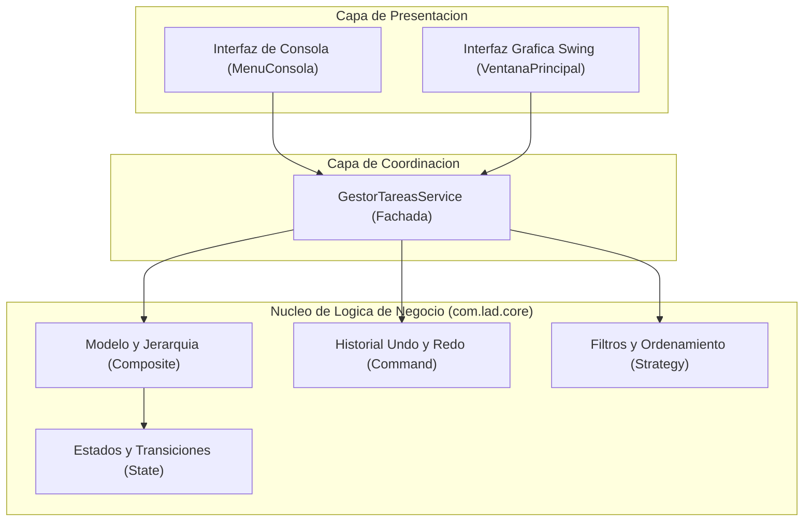

```mermaid
flowchart TD
    subgraph Presentacion["Capa de Presentacion"]
        Consola["Interfaz de Consola (MenuConsola)"]
        Swing["Interfaz Grafica Swing (VentanaPrincipal)"]
    end

    subgraph Servicio["Capa de Coordinacion"]
        Facade["GestorTareasService (Fachada)"]
    end

    subgraph Nucleo["Nucleo de Logica de Negocio (com.lad.core)"]
        Composite["Modelo y Jerarquia (Composite)"]
        State["Estados y Transiciones (State)"]
        Command["Historial Undo y Redo (Command)"]
        Strategy["Filtros y Ordenamiento (Strategy)"]
    end

    Consola --> Facade
    Swing --> Facade

    Facade --> Composite
    Facade --> Command
    Facade --> Strategy
    Composite --> State
```
